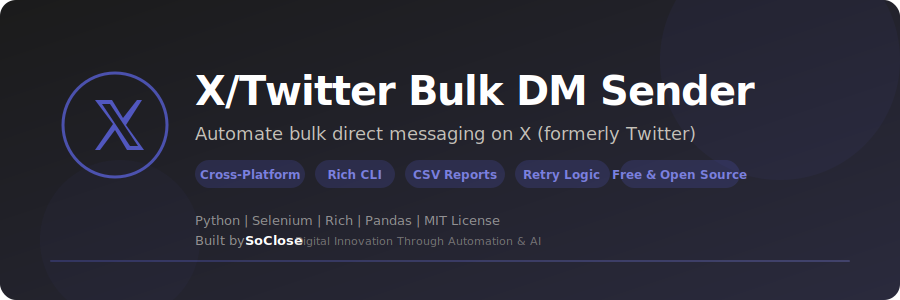

<p align="center">
  
</p>

<p align="center">
  <strong>Automate bulk direct messaging on X (formerly Twitter) — professional CLI with progress tracking and reports.</strong>
</p>

<p align="center">
  <a href="LICENSE"></a>
  <a href="https://www.python.org/downloads/"></a>
  
  <a href="https://www.selenium.dev/"></a>
  <a href="https://github.com/SoCloseSociety/TwitterBulkMpSender/stargazers"></a>
  <a href="https://github.com/SoCloseSociety/TwitterBulkMpSender/issues"></a>
  <a href="https://github.com/SoCloseSociety/TwitterBulkMpSender/network/members"></a>
</p>

<p align="center">
  <a href="#quick-start">Quick Start</a> &bull;
  <a href="#key-features">Features</a> &bull;
  <a href="#configuration">Configuration</a> &bull;
  <a href="#faq">FAQ</a> &bull;
  <a href="#contributing">Contributing</a>
</p>

---

## What is X/Twitter Bulk DM Sender?

**X/Twitter Bulk DM Sender** is a free, open-source **X/Twitter automation tool** built with Python and Selenium. It automates sending direct messages to multiple X/Twitter profiles from a CSV list. The tool features a professional Rich CLI interface with progress bars, status tables, and detailed reporting.

Instead of manually messaging contacts one by one, this bot handles the entire outreach process with smart delays, retry logic, and automatic CSV report generation.

### Who is this for?

- **Growth Hackers** running DM outreach campaigns on X/Twitter
- **Digital Marketers** engaging with prospects at scale
- **Community Managers** sending announcements to members
- **Startup Founders** doing cold outreach to potential customers
- **Sales Teams** automating initial contact with leads
- **Content Creators** networking with peers and collaborators

### Key Features

- **Branded CLI Interface** - Professional terminal UI with progress bars and status tables
- **Smart Browser Automation** - Selenium WebDriver with anti-detection and configurable timeouts
- **CSV Profile Management** - Validated input with deduplication and preview
- **Retry Logic** - Configurable retry attempts per profile with intelligent failure handling
- **Rate Limiting** - Random delays between messages to avoid detection
- **Detailed Reporting** - Automatic CSV report generation (success/failed/skipped)
- **Configurable** - Environment variables for delays, timeouts, and retries
- **Cross-Platform** - Works on Windows, macOS, and Linux
- **Free & Open Source** - MIT license, no API key required

---

## Quick Start

### Prerequisites

| Requirement | Details |
|-------------|---------|
| **Python** | Version 3.8 or higher ([Download](https://www.python.org/downloads/)) |
| **Google Chrome** | Latest version ([Download](https://www.google.com/chrome/)) |
| **X/Twitter Account** | A valid X/Twitter account |

### Installation

```bash
# 1. Clone the repository
git clone https://github.com/SoCloseSociety/TwitterBulkMpSender.git
cd TwitterBulkMpSender

# 2. (Recommended) Create a virtual environment
python -m venv venv

# Activate it:
# Windows:
venv\Scripts\activate
# macOS / Linux:
source venv/bin/activate

# 3. Install dependencies
pip install -r requirements.txt

# 4. Configure (optional)
cp .env.example .env
```

### Prepare Your Data

**CSV file** with a `tweeter_profile_link` column:

```csv
,tweeter_profile_link,tweeter_profile_name
0,/username1,@username1
1,/username2,@username2
```

**Message file** (`message.txt`):

```
Your message content here.
```

### Run

```bash
python main.py
```

Follow the CLI prompts:
1. Enter your CSV file path (or press Enter for `Test.csv`)
2. Review the profile summary and message preview
3. Log into X/Twitter in the browser window
4. Press Enter to start the DM session
5. Monitor progress in real-time
6. Review the summary report

---

## Configuration

| Variable | Default | Description |
|----------|---------|-------------|
| `DELAY_MIN` | `3` | Minimum delay between messages (seconds) |
| `DELAY_MAX` | `7` | Maximum delay between messages (seconds) |
| `TIMEOUT` | `15` | Selenium element wait timeout (seconds) |
| `MAX_RETRIES` | `3` | Max retry attempts per profile |
| `MESSAGE_FILE` | `message.txt` | Path to the message file |

---

## Reports

After each session, a detailed CSV report is saved to the `reports/` directory:

```
reports/dm_report_20260219_143022.csv
```

Each report contains: profile, status (success/failed/skipped), reason, and timestamp.

---

## How It Works

```
CSV Profile List          message.txt
       │                        │
       ▼                        ▼
┌─────────────────────────────────────┐
│         SoClose DM Engine           │
│                                     │
│  1. Launch Chrome                   │
│  2. Manual login to X/Twitter       │
│  3. For each profile:               │
│     → Navigate to profile           │
│     → Open DM conversation          │
│     → Type & send message           │
│     → Log result (success/failed)   │
│  4. Generate CSV report             │
└─────────────────────────────────────┘
       │
       ▼
reports/dm_report_YYYYMMDD.csv
```

---

## Project Structure

```
TwitterBulkMpSender/
├── main.py              # CLI entry point
├── config.py            # Configuration & branding
├── browser.py           # Chrome WebDriver management
├── messenger.py         # DM sending logic
├── utils.py             # Utilities (validation, reporting)
├── requirements.txt     # Python dependencies
├── .env.example         # Environment config template
├── message.txt          # Message content
├── Test.csv             # Sample profile data
├── assets/
│   └── banner.svg       # Project banner
├── LICENSE              # MIT License
├── README.md            # This file
├── CONTRIBUTING.md      # Contribution guidelines
├── .gitignore           # Git ignore rules
└── reports/             # Generated session reports
```

---

## Troubleshooting

### Chrome driver issues

```bash
pip install --upgrade webdriver-manager
```

### Login issues

The browser opens for manual login. If you encounter issues:
1. Make sure Chrome is up to date
2. Complete any security challenges manually
3. Press Enter only after you're fully logged in

### Messages not sending

1. X/Twitter may have updated its UI — open an issue
2. Your account may be restricted — wait before retrying
3. Try increasing delay values in `.env`

---

## FAQ

**Q: Is this free?**
A: Yes. 100% free and open source under the MIT license.

**Q: Do I need an API key?**
A: No. Browser automation via Selenium, no API key needed.

**Q: How many DMs can I send?**
A: No hard limit in the tool. X/Twitter has its own DM limits — use reasonable delays.

**Q: Does it work on Mac / Linux?**
A: Yes. Fully cross-platform.

---

## Alternatives Comparison

| Feature | X/Twitter Bulk DM | Manual DMs | Paid DM Tools |
|---------|-------------------|------------|---------------|
| Price | **Free** | Free | $50-200/mo |
| Bulk sending | Yes | No | Yes |
| CSV reports | Yes | Manual | Varies |
| Retry logic | Yes | N/A | Yes |
| Open source | Yes | N/A | No |
| API key required | No | No | Yes |
| Cross-platform | Yes | Yes | Web only |

---

## Contributing

Contributions are welcome! Please read the [Contributing Guide](CONTRIBUTING.md) before submitting a pull request.

---

## License

This project is licensed under the [MIT License](LICENSE).

---

## Disclaimer

This tool is intended for **legitimate outreach and business communication purposes only**. Users are responsible for complying with X/Twitter's Terms of Service. Do not use this tool for spam or unsolicited messaging. The authors are not responsible for any misuse or account restrictions.

---

<p align="center">
  <strong>If this project helps you, please give it a star!</strong><br>
  It helps others discover this tool.<br><br>
  <a href="https://github.com/SoCloseSociety/TwitterBulkMpSender">
    
  </a>
</p>

<br>

<p align="center">
  <sub>Built with purpose by <a href="https://soclose.co"><strong>SoClose</strong></a> &mdash; Digital Innovation Through Automation & AI</sub><br>
  <sub>
    <a href="https://soclose.co">Website</a> &bull;
    <a href="https://linkedin.com/company/soclose-agency">LinkedIn</a> &bull;
    <a href="https://twitter.com/SoCloseAgency">Twitter</a> &bull;
    <a href="mailto:hello@soclose.co">Contact</a>
  </sub>
</p>
